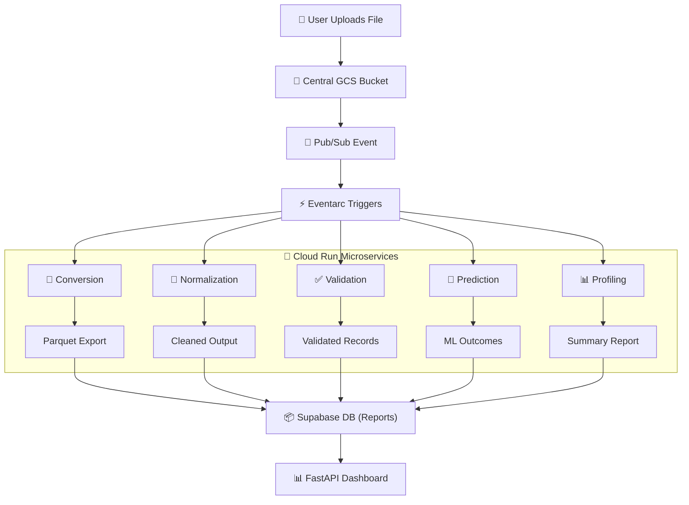
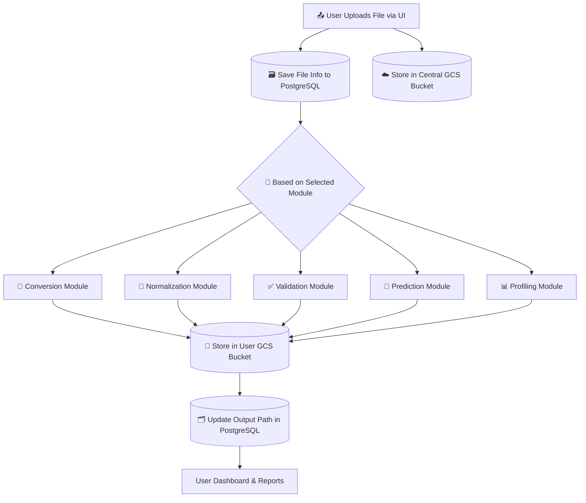

<p align="center">
  
</p>

<h1 align="center">🚀 DatumSync by VR²N</h1>

<p align="center"><em>
Eliminate bad data. Build real confidence.
</em></p>

---
## 🔗 Visit us at [https://vr2n.com](https://vr2n.com)

**DatumSync** is an intelligent, automated data pipeline platform developed by [VR²N](https://github.com/vr2n) to streamline large-scale data processing. Built with modular architecture and cloud-native design, it supports:

**✅ Validation** • **🌀 Normalization** • **🔁 Conversion** • **🔮 Prediction** • **📊 Profiling**

Backed by FastAPI, Google Cloud, and a powerful real-time dashboard, DatumSync is your all-in-one solution for intelligent data operations.

> *DatumSync is currently in private development. To explore or partner, [contact us](mailto:hello@vr2n.io).*

---

## 🧠 Why DatumSync?

> “A modern enterprise needs more than just pipelines — it needs *intelligence at every step*.”

### ✨ Key Features

- ✅ **Data Validation** — Ensures schema and data integrity
- 🌀 **Normalization** — Standardizes messy datasets
- 🔁 **Conversion** — Automates CSV-to-Parquet transformations
- 🔮 **Prediction** — Uses ML models to infer data outcomes
- 📊 **Profiling** — Auto-generates reports with descriptive stats
- 📈 **Interactive Dashboard** — Visualize pipeline activity in real time
- 💳 **Pro Plan with Stripe** — Unlock unlimited usage and premium features

---

## ⚙️ Tech Stack

| Layer            | Technologies                                                               |
| ---------------- | -------------------------------------------------------------------------- |
| **Backend**       | FastAPI, SQLAlchemy, Authlib                                               |
| **Frontend**      | Jinja2, Tailwind CSS, Chart.js                                             |
| **Cloud Infra**   | Google Cloud Run, Cloud Storage, Pub/Sub, Terraform                       |
| **Data & ML**     | Pandas, Scikit-learn                                                       |
| **Database**      | Supabase PostgreSQL                                                        |
| **Billing**       | Stripe Checkout + Webhooks                                                 |
| **Auth**          | Google OAuth 2.0                                                           |

---

## 🧩 How It Works


---

---
## 🧹 Modules & Routes

| Module        | Endpoint                                      | Description                       |
| ------------- | --------------------------------------------- | --------------------------------- |
| Auth          | `/login`, `/auth/callback`                    | Google OAuth 2.0 Login            |
| Validation    | `/validate`, `/columns`                       | File-based schema and data check  |
| Normalization | `/normalize`, `/normalize-file`               | Standardizes data formats         |
| Conversion    | `/convert`                                    | CSV to Parquet conversion         |
| Prediction    | `/predict`                                    | ML predictions on normalized data |
| Profiling     | `/profile`                                    | Data profiling reports            |
| Dashboard     | `/dashboard`                                  | Interactive stats and graphs      |
| Subscription  | `/subscription`, `/subscribe/pro`, `/success` | Stripe Pro Plan                   |

---
## ☁️ Deployment

This project is deployed via:

* 🔧 **Render (App Hosting)**
* ☁️ **Google Cloud Run (Modular services)**
* 📎 **Stripe (Billing)**
* 📃 **Supabase (PostgreSQL DB & auth)**

---
## 🛡️ Uptime & Reliability
To ensure continuous availability of the application hosted on a free-tier Render instance, a proactive uptime monitoring solution was implemented:

* **🧩 Strategy**
/health Endpoint
A lightweight health-check endpoint (GET /health) was added to confirm app readiness and ensure it responds with HTTP 200 OK.

* **🛠️ Uptime Monitoring with UptimeRobot**
UptimeRobot is used to ping the /health endpoint every 5 minutes, preventing the service from entering cold-start or sleep mode (a common limitation of free-tier platforms).

* **🧠 Benefit**
This setup ensures real-time reliability, faster response times, and uninterrupted user experience — all without requiring paid infrastructure.
```bash
@app.get("/health")
async def health_check():
    return {"status": "ok"}
```
---

## ✅ What's Unique?

* **GCP-native triggers:** Event-driven architecture using Pub/Sub and Cloud Run.
* **Stripe Checkout + Webhooks:** Full billing cycle implemented.
* **Modular cloud pipeline:** Each stage (e.g., validation, prediction) is its own microservice.
* **Real-time dashboard with visual analytics.**

---

## 📌 Google-readiness Highlights

* Full-stack GCP + Python + FastAPI implementation
* Clean modular microservice architecture
* Secure OAuth authentication + database integration
* Production-grade billing system with Stripe
* Optimized for large datasets (500k+ records)
* Dockerized for scalable deployment

---

## 👨‍💻 Author

**Shubham Singh**
MSc Data Science, University of Nottingham
📧 [shubhamsinghvr2n@gmail.com](mailto:shubhamsinghvr2n@gmail.com)
🔗 [LinkedIn](https://www.linkedin.com/in/shubhamsinghvr) | [GitHub](https://github.com/vr2n)

---
